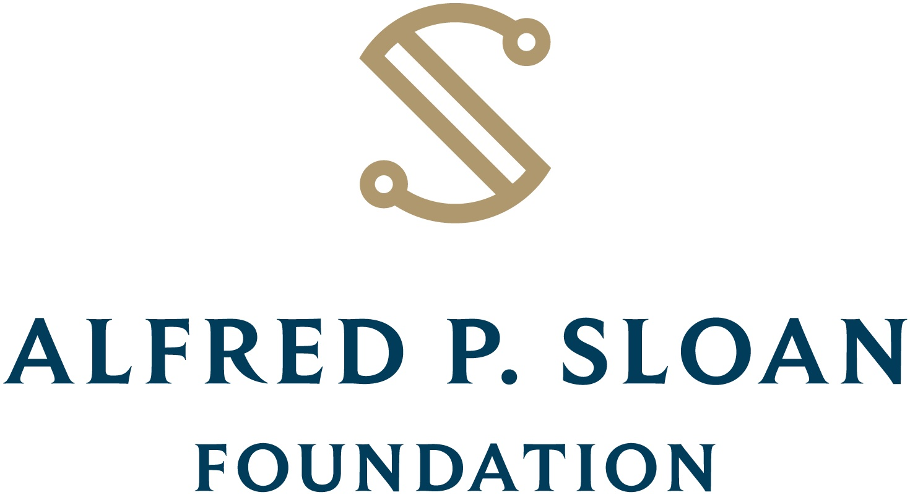

<p align="center">
  <a href="https://github.com/privacy-tech-lab/gpc-optmeowt/releases"></a>
  <a href="https://github.com/privacy-tech-lab/gpc-optmeowt/releases"></a>
  <a href="https://github.com/privacy-tech-lab/gpc-optmeowt/commits/main"></a>
  <a href="https://github.com/privacy-tech-lab/gpc-optmeowt/actions/workflows/node.js.yml"></a>
  <a href="https://github.com/privacy-tech-lab/gpc-optmeowt/issues"></a>
  <a href="https://github.com/privacy-tech-lab/gpc-optmeowt/issues?q=is%3Aissue+is%3Aclosed"></a>
  <a href="https://github.com/privacy-tech-lab/gpc-optmeowt/blob/main/LICENSE.md"></a>
  <a href="https://github.com/privacy-tech-lab/gpc-optmeowt/watchers"></a>
  <a href="https://github.com/privacy-tech-lab/gpc-optmeowt/stargazers"></a>
  <a href="https://github.com/privacy-tech-lab/gpc-optmeowt/network/members"></a>
  <a href="https://github.com/sponsors/privacy-tech-lab"></a>
</p>
  
<br>

<p align="center">
  <a href="https://privacytechlab.org/"></a>
</p>

# OptMeowt 🐾

OptMeowt ("Opt Me Out") is a browser extension for opting you out from web tracking. OptMeowt works by sending Global Privacy Control (GPC) signals to visited websites per the [GPC spec](https://privacycg.github.io/gpc-spec/) that we are developing [at the W3C](https://github.com/privacycg/proposals/issues/10) and placing opt out cookies.

<p align="center">
  <a href="https://addons.mozilla.org/en-US/firefox/addon/optmeowt/"></a>
  <a href="https://chrome.google.com/webstore/detail/optmeowt/hdbnkdbhglahihjdbodmfefogcjbpgbo"></a>
<p>

OptMeowt is developed and maintained by Oliver Wang (@OliverWang13), Sophie Eng (@sophieeng), Kate Hausladen (@katehausladen), Matt May (@Mattm27), Francisca Wijaya (@franciscawijaya), and Sebastian Zimmeck (@SebastianZimmeck) of the [privacy-tech-lab](https://privacytechlab.org/). Jocelyn Wang (@Jocelyn0830), Kuba Alicki (@kalicki1), Stanley Markman (@stanleymarkman), Kiryl Beliauski (@kbeliauski), Daniel Knopf (@dknopf), and Abdallah Salia (@asalia-1) contributed earlier. Learn more [here](https://privacytechlab.org/).

[1. Research Publications](#1-research-publications)  
[2. Promo Video](#2-promo-video)  
[3. How Does OptMeowt Work?](#3-how-does-optmeowt-work)  
[4. Installing OptMeowt from Source](#4-installing-optmeowt-from-source)  
[5. Installing OptMeowt for Developers](#5-installing-optmeowt-for-developers)  
[6. Installing the OptMeowt PETS 2023 Version](#6-installing-the-optmeowt-pets-2023-version)  
[7. Testing](#7-testing)  
[8. OptMeowt's Permission Use](#8-optmeowts-permission-use)  
[9. OptMeowt's Architecture](#9-optmeowts-architecture)  
[10. Directories in this Repo](#10-directories-in-this-repo)  
[11. Third Party Libraries](#11-third-party-libraries)  
[12. Developer Guide](#12-developer-guide)  
[13. Thank You!](#13-thank-you)

## 1. Research Publications

- Sebastian Zimmeck, Eliza Kuller, Chunyue Ma, Bella Tassone and Joe Champeau, [Generalizable Active Privacy Choice: Designing a Graphical User Interface for Global Privacy Control](https://sebastianzimmeck.de/zimmeckEtAlGPC2024.pdf), 24th Privacy Enhancing Technologies Symposium (PETS), Bristol, UK and Online Event, July 2024, [BibTeX](https://sebastianzimmeck.de/citations.html#zimmeckEtAlGPC2024Bibtex)
- Nishant Aggarwal, Wesley Tan, Konrad Kollnig, Sebastian Zimmeck, [The Invisible Threat: Exploring Mobile Privacy Concerns](https://github.com/privacy-tech-lab/gpc-optmeowt/blob/main/research/aggarwalEtAlInvisibleThreat2023Poster.pdf), Summer Research 2023 Poster Session, Wesleyan University, July 2023
- Sebastian Zimmeck, Oliver Wang, Kuba Alicki, Jocelyn Wang and Sophie Eng, [Usability and Enforceability of Global Privacy Control](https://sebastianzimmeck.de/zimmeckEtAlGPC2023.pdf), 23rd Privacy Enhancing Technologies Symposium (PETS)
  Lausanne, Switzerland and Online Event, July 2023, [BibTeX](https://sebastianzimmeck.de/citations.html#zimmeckEtAlGPC2023Bibtex). For installing the OptMeowt version used in this paper, see the [instructions below](https://github.com/privacy-tech-lab/gpc-optmeowt#6-installing-the-optmeowt-pets-2023-version).
- Isabella Tassone, Chunyue Ma, Eliza Kuller, Joe Champeau and Sebastian Zimmeck, [Enhancing Online Privacy: The Development of Practical Privacy Choice Mechanisms](https://github.com/privacy-tech-lab/gpc-optmeowt/blob/main/research/tassoneEtAlEnhancingOnlinePrivacy2022Poster.pdf), Summer Research 2022 Poster Session, Wesleyan University, July 2022
- Sebastian Zimmeck, [Improving Internet Privacy with Global Privacy Control (GPC)](https://sebastianzimmeck.de/SaTC_PI_Meeting_2022_Poster_GPC_Zimmeck.pdf), 5th NSF Secure and Trustworthy Cyberspace Principal Investigator Meeting (2022 SaTC PI Meeting), Arlington, Virginia, USA, June 2022
- Kuba Alicki, [Don't Sell Our Data: Exploring CCPA Compliance via Automated Privacy Signal Detection](https://digitalcollections.wesleyan.edu/islandora/dont-sell-our-data-exploring-ccpa-compliance-automated-privacy-signal-detection), Undergraduate Honors Thesis, Wesleyan University, April 2022
- Eliza Kuller, Chunyue Ma, Isabella Tassone and Sebastian Zimmeck, [Making Online Privacy Choice Mechanisms Effective and Usable](http://summer21.research.wesleyan.edu/2021/07/22/balancing-usability-and-active-choice-while-developing-privacy-permission-schemes/), Summer Research 2021 Poster Session, Wesleyan University, Online, July 2021
- Sebastian Zimmeck and Kuba Alicki, [Standardizing and Implementing Do Not Sell (Short Paper)](https://sebastianzimmeck.de/zimmeckAndAlicki2020DoNotSell.pdf), 19th Workshop on Privacy in the Electronic Society (WPES), Online Event, November 2020, [BibTeX](https://sebastianzimmeck.de/citations.html#zimmeckAndAlicki2020DoNotSellBibtex)

## 2. Promo Video

[](https://drive.google.com/file/d/1eto77EV13WazpJN1hGXiKKsP2l7oMEu1/view?usp=share_link)

## 3. How Does OptMeowt Work?

OptMeowt sends Do Not Sell signals to websites when you browse the web. Such signals must be respected for California consumers per the California Consumer Privacy Act (CCPA), [Regs Section 999.315(d)](https://oag.ca.gov/sites/all/files/agweb/pdfs/privacy/oal-sub-final-text-of-regs.pdf). Some companies also respect them when they are sent from outside of California. OptMeowt also places opt out cookies.

In detail, OptMeowt uses the following methods to opt you out:

1. The [GPC header and JS property](https://globalprivacycontrol.github.io/gpc-spec/).
2. The [DNT header](https://www.w3.org/TR/tracking-dnt/).
3. First party cookies of ad networks participating in the [IAB CCPA Compliance Framework for Publishers & Technology Companies](https://iabtechlab.com/standards/ccpa/).
4. Third party cookies of ad networks participating in the [DAA's CCPA Opt Out Tool for the Web](https://digitaladvertisingalliance.org/integrate-webchoices-ccpa).

**Customizing which sites receive Do Not Sell signals:** For every site you visit OptMeowt will automatically add its domain to the `domain list`. Each newly added domain will receive Do Not Sell signals by default. However, you can exclude domains that should not receive Do Not Sell signals. This functionality is available on OptMeowt's settings page, which you can access from OptMeowt's popup window.

**Opting Out of the Topics API:** Google is phasing out the use of third-party cookies, and replacing them with the Topics API. The Topics API will identify users' general areas of interest which can be used for personalized advertising. These topics are generated through observing and recording a user's browser activity. To opt you out of the Topics API, a header is placed called `Permissions-Policy` on all the sites you browse. This is following [Google's documentation](https://developer.chrome.com/en/docs/privacy-sandbox/topics/#site-opt-out) of how to opt a site out of the Topics API. Please keep in mind this functionality is only available for Chrome browsers.

## 4. Installing OptMeowt from Source

1. Clone this repo locally or download a zipped copy and unzip it.
2. Install [npm](https://docs.npmjs.com/downloading-and-installing-node-js-and-npm).
3. From within your local `/gpc-optmeowt/` directory install OptMeowt's dependencies with `npm ci`.
4. Build the project by running `npm run build`, which will create a built for both Chrome and Firefox in `.../gpc-optmeowt/dist/chrome/` and `.../gpc-optmeowt/dist/firefox/`, respectively. `npm run build` will also create packaged versions of OptMeowt in `.../gpc-optmeowt/packages` for distribution on the Chrome Web Store and on Firefox Add-Ons.

### Chrome

5. In Chrome, navigate to the extensions page at `chrome://extensions/`.
6. Enable `Developer mode` with the slider on the top right corner of the extension page.
7. Click the `Load unpacked` button in the top left of the page.
8. Select the directory where you built OptMeowt, by default `/gpc-optmeowt/dist/chrome/` (the directory that contains the `manifest.json``).

### Firefox

5. In Firefox, navigate to the addons page with developer privileges at `about:debugging#/runtime/this-firefox`.
6. Under `Temporary extensions`, click `Load Temporary Add-on..`.
7. Select the manifest from the directory where you built OptMeowt, by default `/gpc-optmeowt/dist/firefox/manifest.json/`.

**Note:** OptMeowt is in active development and new features are frequently added, some of which may cause errors. You can always get the stable release version on the [Chrome Web Store](https://chrome.google.com/webstore/detail/optmeowt/hdbnkdbhglahihjdbodmfefogcjbpgbo) and on [Firefox Add-Ons](https://addons.mozilla.org/en-US/firefox/addon/optmeowt/).

## 5. Installing OptMeowt for Developers

To build the development versions of OptMeowt follow the directions above but replace `npm run build` with `npm run start`. This command will run the npm script (referenced in `package.json`) that will call Webpack in development mode (Webpack settings in `webpack.config.js`). `npm run start` will also initiate Webpack servers for both the Firefox and Chrome versions, which will listen for changes as you work and rebuild as necessary.

**Webpack and file structure notes:**

Webpack will build the development versions of OptMeowt into the `dev` subdirectory instead of the `dist` subdirectory. The subdirectories for Chrome and Firefox are `dev/chrome` and `dev/firefox`, respectively.

Also, when you build for development, the development manifest (in `src/manifest-dev.json`) will be used instead of the distribution manifest (in `src/manifest-dist.json`). The development manifest contains an unsafe eval that we use for our source maps during development. The distribution manifest does not contain this eval. Webpack will select the correct manifest depending on whether you build for development or distribution.

To include new dependencies you can run `npm install` instead of `npm ci`. `npm install` will include new dependencies in the `package-lock.json`, which is generated from the `package.json`.

**For Windows Users:**

Note that we have built most of our codebase in MacOS, so path variables and similar code may cause the build to break in other OSs, in particular Windows. We recommend installing a Linux OS if you will be working with the codebase in any significant manner.

**Optional:**

We also like to use [Debugger for Firefox](https://marketplace.visualstudio.com/items?itemName=firefox-devtools.vscode-firefox-debug) from within VSCode when in development to help automate loading the built extension package. The default behavior is `F5` to launch and load the extension in browser. There is a similar extension for Chrome, [Debugger for Chrome](https://marketplace.visualstudio.com/items?itemName=msjsdiag.debugger-for-chrome). Make sure to follow the online documentation on writing the correct `.vscode/launch.json` file, or other necessary settings files, in order to properly load OptMeowt with the debugger.

## 6. Installing the OptMeowt PETS 2023 Version

The version of OptMeowt used in our PoPETs 2023 submission, "Usability and Enforceability of Global Privacy Control", can be found in our [v3.0.0-paper release](https://github.com/privacy-tech-lab/gpc-optmeowt/releases/tag/v3.0.0-paper). To view the v3.0.0-paper code, you can look at the repo [here](https://github.com/privacy-tech-lab/gpc-optmeowt/tree/v3.0.0-paper). Instructions for building the extension locally is the same as stated above, as seen in our [Firefox instructions](https://github.com/privacy-tech-lab/gpc-optmeowt/tree/main#firefox). To activate Analysis mode in v3.0.0-paper, press the `Protection Mode` label in the popup. In addition, Analysis mode requires other privacy extensions or browsers to be disabled. For further detailed information on how to use analysis mode, please refer to [our methodology](https://github.com/privacy-tech-lab/gpc-optmeowt/tree/v4.0.1/#4-analysis-mode-firefox-only).

Analysis mode used to be incorporated with the OptMeowt extension but can now be found in a [separate repo](https://github.com/privacy-tech-lab/gpc-web-crawler), specialized for crawling the internet while using analysis mode.

## 7. Testing

OptMeowt uses the [Mocha](https://mochajs.org/) framework and [Puppeteer](https://pptr.dev/) to execute its testing and continuous integration. The continuous integration is built into the OptMeowt repo with Github Actions. The [Actions tab](https://github.com/privacy-tech-lab/gpc-optmeowt/actions) shows all workflows and past unit test checks for previous PRs.

The test responsible for checking OptMeowt’s ability to set the GPC signal can not be run with GitHub Actions and can only be run locally when running `npm test`. Using Puppeteer, this will launch an automated headful browser on Chromium, testing the Chrome GPC signal against the [GPC reference server](https://global-privacy-control.glitch.me/).

### Running Automated Unit Tests

**Locally:**
You can run unit tests locally.

1. Clone this repo locally or download a zipped copy and unzip it.
2. Make sure npm is up to date by running `npm -v` to check the version and updating follow the instructions [here](https://docs.npmjs.com/try-the-latest-stable-version-of-npm), depending on the operating system.
3. Run tests with `npm test`. If Puppeteer is uninstalled, run `npm install`.

**Continuous Integration:**
The continuous integration is built into the OptMeowt repo, therefore no changes to the extension environment are needed to run new tests.

### Manual UI testing

The following procedure is for testing the OptMeowt extension UI, which cannot be automated. They are recommended to be performed manually as follows:

1. Download the version of the extension you want to test through `npm run start` and then download the unpacked dev version for your browser.
2. Navigate to a site with the well-known file, like "https://global-privacy-control.glitch.me/"
3. Click on the OptMeowt symbol in the top right of your browser.
   - [ ] TEST 1: The symbol for the cat should be solid green.
   - [ ] TEST 2: The URL of the website should be written under the "Protection Mode" banner.
   - [ ] TEST 3: Do Not Sell should be enabled.
   - [ ] TEST 4: There should be a blue number detailing the number of domains receiving signals.
4. Click on the drop down for "3rd Party Domains".
   - [ ] TEST 5: There should be sites that show up with Do Not Sell Enabled switched on.
5. Navigate out of the "3rd Party Domains" drop down and click on the "Website Response" drop down
   - [ ] TEST 6: There should be text showing that GPC Signals were accepted.
   - [ ] TEST 7: Switch "Dark Mode" on and off and ensure the popup is correctly changing colors.
6. Navigate to the top of the popup and click on the "More" symbol (image: Sliders) to go to the Settings page.
7. In the main settings page, click on "Disable" and open the popup.
   - [ ] TEST 8: The popup should be fully grayed out and showing the popup disabled.
8. In the website, move to the Domainlist page.
   - [ ] TEST 9: There should be multiple domains showing in the Domainlist tab.
9. Go back to the main settings page and export Domainlist.
   - [ ] TEST 10: Check the exported Domainlist and the Domainlist in the settings page to make sure the websites match up.

### Creating a New Test

1. Navigate to ‘.../gpc-optmeowt/test/’. Then navigate to the folder in the test directory that corresponds to the tested function’s location in the extension source code.
2. Create a new file in the matching folder. Name the file with the format `FUNCTION_NAME.test.js`.
   For example, if testing a function named `sum` located in the folder `.../src/math`, create the test called `sum.test.js` in the folder `.../test/math`
3. Write test using [ECMAScript formatting](https://nodejs.org/api/esm.html).

## 8. OptMeowt's Permission Use

**Note:** We do not collect any data from you. Third parties will also not receive your data. The permissions OptMeowt is using are required for opting you out. To that end, OptMeowt uses the following permissions:

```json
"permissions": [
    "declarativeNetRequest",
    "webRequest",
    "webNavigation",
    "storage",
    "activeTab",
    "cookies",
    "tabs",
    "scripting"
  ]
```

- `declarativeNetRequest`: Allows OptMeowt to modify rules, allowing us to send the GPC header
- `webRequest`: Pauses outgoing HTTP requests to append opt out headers
- `webNavigation`: Similar to `webRequest`, allows OptMeowt to check when navigation requests are made to reset processes
- `storage`: Allows OptMeowt to save your opt out preferences in your browser
- `activeTab`: Allows OptMeowt to set opt out signals on your active browser tab
- `cookies`: Allows OptMeowt to place opt out cookies in your browser
- `tabs`: Allows OptMeowt to keep track of HTTP headers per tab to show you the opt out status of the current site in a popup
- `scripting`: Allows OptMeowt to declare content scripts and send the GPC DOM signal

## 9. OptMeowt's Architecture

Detailed information on OptMeowt's architecture is available in a [separate readme](https://github.com/privacy-tech-lab/gpc-optmeowt/blob/main/README_ARCHITECTURE.md). Please note that the architecture readme is current as of its commit date. We try to update it as soon as possible after any architectural changes. However, it may lag behind.

## 10. Directories in this Repo

- `src/`: Main contents of the OptMeowt browser extension.
- `src/assets`: Graphical elements of the extension, including logos and button images.
- `src/background`: Listeners for events and logic for placing cookies.
- `src/data`: Definitions of headers, cookies, and privacy flags.
- `src/options`: UI elements and scripts for the supplemental options page.
- `src/popup`: UI elements and scripts for the popup inside the extensions bar.
- `src/theme`: Dark and light mode themes.
- `ui-mockup`: Contains PDF and XD files demonstrating the preliminary mockup of OptMeowt.

## 11. Third Party Libraries

OptMeowt uses various [third party libraries](https://github.com/privacy-tech-lab/gpc-optmeowt/blob/main/package.json). We thank the developers.

## 12. Developer Guide

### Contributing

- If you want to contribute, note that we manage all library dependencies with npm. Thus, it is recommended to use `npm i` to install libraries.
- If you have questions about OptMeowt's functionality or have found a bug, please check out our [FAQ \ Known quirks](https://github.com/privacy-tech-lab/gpc-optmeowt/wiki/FAQ-%5C-Known-quirks) page on the [Wiki](https://github.com/privacy-tech-lab/gpc-optmeowt/wiki) first. If you cannot find what you are looking for, feel free to open an issue, and we will address it.
- Note: When viewing your browser's console on a site, a 404 error regarding the domain's GPC status file (`/.well-known/gpc.json`) may be shown. Note that this is normal and will occur (1) on domains that do not support GPC and (2) on domains that support GPC but do not host a `/.well-known/gpc.json` file.

## 13. Thank You!

<p align="center"><strong>We would like to thank our financial supporters!</strong></p><br>

<p align="center">Major financial support provided by the National Science Foundation.</p>

<p align="center">
  <a href="https://nsf.gov/awardsearch/showAward?AWD_ID=2055196">
    
  </a>
</p>

<p align="center">Additional financial support provided by the Alfred P. Sloan Foundation, Wesleyan University, and the Anil Fernando Endowment.</p>

<p align="center">
  <a href="https://sloan.org/grant-detail/9631">
    
  </a>
  <a href="https://www.wesleyan.edu/mathcs/cs/index.html">
    
  </a>
</p>

<p align="center"><a href="https://builtwith.com/">BuiltWith</a> provided us with a free Pro account.</p>

<p align="center">Conclusions reached or positions taken are our own and not necessarily those of our financial supporters, its trustees, officers, or staff.</p>

##

<p align="center">
  <a href="https://privacytechlab.org/"></a>
<p>
